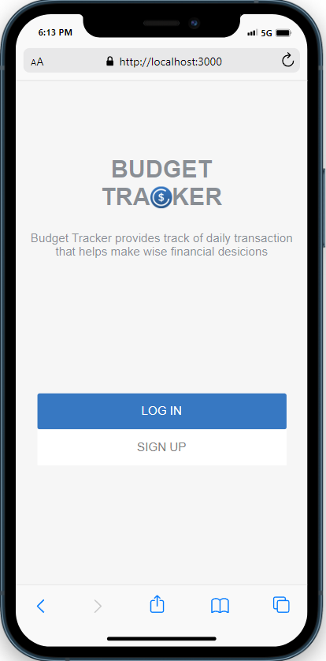
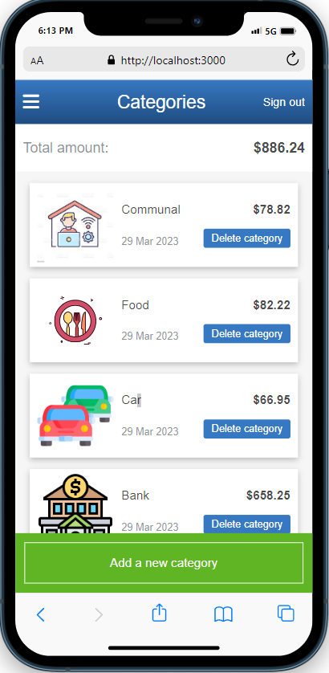

# 📗 Table of Contents

- [📖 About the Project](#about-project)
  - [🛠 Built With](#built-with)
    - [Tech Stack](#tech-stack)
    - [Key Features](#key-features)
  - [🚀 Live Demo](#live-demo)
  - [📽️ Video Presentation](#video)
- [💻 Getting Started](#getting-started)
  - [Setup](#setup)
  - [Prerequisites](#prerequisites)
  - [Install](#install)
  - [Usage](#usage)
  - [Run tests](#run-tests)
  - [Deployment](#triangular_flag_on_post-deployment)
- [👥 Authors](#authors)
- [🔭 Future Features](#future-features)
- [🤝 Contributing](#contributing)
- [⭐️ Show your support](#support)
- [🙏 Acknowledgements](#acknowledgements)
- [❓ FAQ](#faq)
- [📝 License](#license)

<!-- PROJECT DESCRIPTION -->

# 📖 Budget Tracker 

> Budget Tracker provides track of daily transaction that helps make wise financial desicions.

 
 

## 🛠 Built With 

### Tech Stack 

  
Ruby on Rails

  <ul>
    <li><a href="https://ruby-doc.org/core-3.1.2/">Ruby</a></li>
  </ul>
    <ul>
    <li><a href="https://ruby-doc.org/core-3.1.2/">Rails</a></li>
  </ul>

<!-- Features -->

### Key Features 

- **Add new categories**
- **Add new transactions**
- **See amount of all transactions**

(<a href="#readme-top">back to top</a>)

### 🚀 Live Demo 

- [Budget Tracker](https://budget-tracker-azmz.onrender.com)

(<a href="#readme-top">back to top</a>)

### 📽️ Video Presentation 

- [Video link](https://www.loom.com/share/1213a4eea2784cfe924a89b3ab8dd3ba)

(<a href="#readme-top">back to top</a>)

<!-- GETTING STARTED -->

## 💻 Getting Started 

To get a local copy up and running follow these simple example steps.

### Prerequisites

In order to run this project you need:

- Install ruby on your computer or run in with docker
- Run `ruby main`

### Setup

Clone this repository by using the command line :

- `git clone https://github.com/FuadNabi/budget-tracker`

### Install

Install this project with:

`bundle install`

### Usage

To run the project, execute the following command:

`ruby main`

(<a href="#readme-top">back to top</a>)

<!-- AUTHORS -->

## 👥 Authors 

👤 **Fuad Nabiyev**

- GitHub: [@githubhandle](https://github.com/FuadNabi)
- Twitter: [@twitterhandle](https://twitter.com/FuadNebiyev2)
- LinkedIn: [LinkedIn](https://www.linkedin.com/in/fuad-nabiyev/)

(<a href="#readme-top">back to top</a>)

<!-- FUTURE FEATURES -->

## 🔭 Future Features 

- **Add view for pc**

(<a href="#readme-top">back to top</a>)

<!-- CONTRIBUTING -->

## 🤝 Contributing 

Contributions, issues, and feature requests are welcome!

Feel free to check the [issues page](https://github.com/FuadNabi/budget-tracker/issues).

(<a href="#readme-top">back to top</a>)

<!-- SUPPORT -->

## ⭐️ Show your support 

If you like this project by staring it.

(<a href="#readme-top">back to top</a>)

<!-- ACKNOWLEDGEMENTS -->

## 🙏 Acknowledgments 

I would like to thank Microverse for learning.
Original design idea by [Gregoire Vella on Behance](https://www.behance.net/gregoirevella).
Please follow the link to read [The Creative Commons license of the design](https://creativecommons.org/licenses/by-nc/4.0/).

Icons were provided by [Justicon](https://www.flaticon.com/authors/justicon)

(<a href="#readme-top">back to top</a>)

<!-- LICENSE -->

## 📝 License 

This project is [MIT](https://github.com/FuadNabi/budget-tracker/blob/create-readme/LICENSE) licensed.
